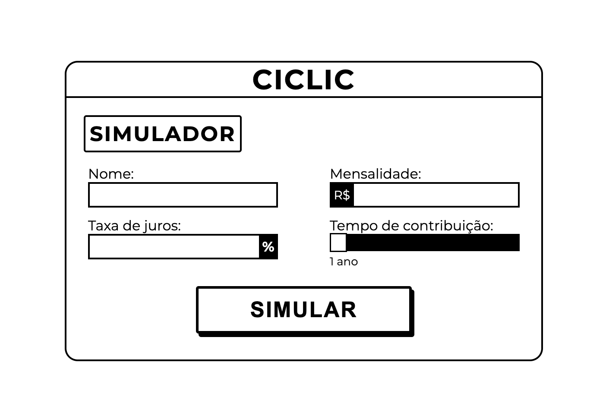

# juros-compostos
Simulador de juros composto utilizando método POST com API math.js

# Usabilidade:
Para utilizar o simulador, basta preencher os campos com os dados desejados:
&nbsp;

# Tela para display dos resultados:
&nbsp;

API utilizada no projeto: http://api.mathjs.org/v4/
